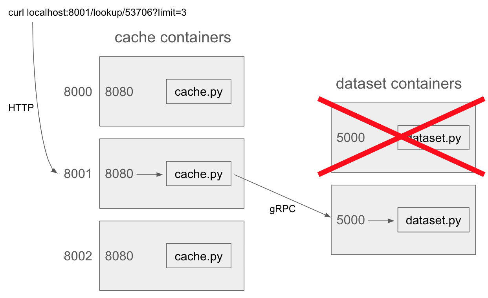

# P2 Solution Notes: gRPC and Containers

> **Config Notes**: 
> TBD

> **Git Troubleshooting Notes**:
> I encountered this issue after pushing a commit from my local machine.  
> On the GCP VM, `git status` showed "main branch is up to date with 'origin/main'", but the new file was missing.  

> - *Git Status vs Remote*  
>   `git status` only checks your local branch against the locally cached `origin/main`. It does not contact the remote server unless you run `git fetch`.
>
> - *No Auto Fetch by Design*  
>   Git avoids auto-fetching to ensure performance, predictability, and user control. Network operations are explicit by default.
>
> - *Work Practice*  
>   In most workplaces, developers fetch manually or rely on CI pipelines. Auto-fetch is rarely enabled.
>
> - *Recommended Command*  
>   Run `git fetch` before `git status` if you want to check for remote updates.


## Introduction

You'll need to write code and Dockerfiles to start 5 containers like this:



Take a look at the provided Docker compose file (you may not modify
it).  Note that there are two services, "cache" with 3 replicas and
"dataset" with 2 replicas.  The cache replicas will forward random
ports on the VM (probably not 8000-8002) to port 8080 inside the
containers.

You should have Dockerfiles named "Dockerfile.cache" and "Dockerfile.dataset" that we can build like this to produce the Docker images for these two services:

```
docker build . -f Dockerfile.cache -t p2-cache
docker build . -f Dockerfile.dataset -t p2-dataset
```

Note that the compose file assumes there is a "PROJECT" environment
variable.  You can set it to p2 in your environment:

```
export PROJECT=p2
```

Whatever this is set to will be a prefix for the container names.  For
example, if it is "abc", your first cache container will be named
"abc-cache-1".  The autograder may use a prefix other than p2 and
will modify the build commands accordingly.

Web requests to the caching layer specify a zipcode, and the number of
addresses that should be returned (the "limit").  To find the answer,
cache containers will ask a dataset container via gRPC.  Requests will
alternate between the two dataset containers to balance the load.  If
one dataset server is down, temporarily or long run, the cache server
should attempt to use the other dataset server to obtain the result.

**Hint 1:** you should test your gRPC server before working on the HTTP/caching server.  Testing the gRPC server independently will probably involve writing some simple client programs beyond what we ask you to do.

**Hint 2:** think about whether there is any .sh script that will help you quickly test code changes.  For example, you may want it to rebuild your Dockerfiles, cleanup an old Compose cluster, and deploy a new cluster.

## Part 1: gRPC Server (Dataset Layer)

Define an RPC service called "PropertyLookup" in a .proto file.  It
should have a single RPC call named "LookupByZip".  This method should
accept a `zip` and `limit` (both int32 values) and return addresses in
a "repeated string" field.

A "dataset.py" server program should override `PropertyLookupServicer`
and start serving with the following code:

```python
server = grpc.server(futures.ThreadPoolExecutor(max_workers=1), options=[("grpc.so_reuseport", 0)])
# TODO: add servicer
server.add_insecure_port("0.0.0.0:5000")
server.start()
server.wait_for_termination()
```

The server should read Madison addresses from "addresses.csv.gz" (downloaded from https://data-cityofmadison.opendata.arcgis.com/datasets/a72d02a4fda34327ae68dd0c2fd07455_20/explore) prior to the first request so it is ready to return addresses.  Given a zipcode, it should return "limit" number of addresses (return the first ones according to an alphanumeric sort).

Create a Dockerfile.dataset that lets you build a Docker image with your code
and any necessary resources.  Note that we won't install any Python
packages (such as the gRPC tools) on our test VM, so it is important
that compiling your .proto file is one of the steps that happens
during Docker build.  Your Dockerfile should also directly copy in the
dataset at build time.

## Part 2: HTTP Server (Cache Layer)

Create an HTTP server in a "cache.py" file.  You can do this with the
help of the Flask framework: https://flask.palletsprojects.com/en/stable/.
Here is some starter code you can use:

```python
import flask
from flask import Flask

app = Flask("p2")

@app.route("/lookup/<zipcode>")
def lookup(zipcode):
    zipcode = int(zipcode)
    limit = flask.request.args.get("limit", default=4, type=int)
    return flask.jsonify({"addrs": ["TODO"], "source": "TODO", "error": None})

def main():
    app.run("0.0.0.0", port=8080, debug=False, threaded=False)

if __name__ == "__main__":
    main()
```

Extend the above code so that it makes gRPC calls to a dataset server
to get real addresses to return back.  Note that the Docker compose
file passes in a "PROJECT" environment variable that you can access
via `os.environ`.  When you deploy server.py in a Docker container
with the help of compose, the two dataset servers will be reachable at
"\<PROJECT\>-dataset-1:5000" and "\<PROJECT\>-dataset-2:5000", so you can
create the gRPC channels/stubs accordingly in cache.py.

Your cache.py program should alternate between sending requests to
dataset server 1 or 2 in order to balance load (the first request
should go to server 1).  In the "source" field of the returned JSON
value, return "1" or "2" to indicate to a client which dataset server
cache.py relied on to obtain the answer.

## Part 3: Retry

When a dataset server is down, your code in cache.py using the stub
will throw a `grpc.RpcError` exception.  When this happens, sleep
100ms, then try the other server.  If there are more failures, just
keep alternating, up to 5 times total.  At that point, specify an
informative string in the "error" field of the JSON being returned
(you can decide what it is, but one approach would be to convert the
exception to a string).

## Part 4: Caching

Imlement a cache in "cache.py" so that your caching server can
sometimes respond to HTTP requests without making a gRPC call to a
dataset server.

Specifications:
* implement an LRU cache of size 3
* a cache entry should consist of a zipcode and 8 corresponding addresses
* if an HTTP request specifies a limit <8 and there IS a corresponding cache entry, just slice the cache entry to get the desired number of addresses
* if an HTTP request specifies a limit <8 and there IS NOT a corresponding cache entry, request 8 addresses from the dataset server anyway so we can create a cache entry useful for subsequent requests
* if an HTTP request specifies a limit >8, we will not be able to use the cache to respond to the request, but you should still add the first 8 addresses to the cache (if not already present)
* caching should allow the HTTP servers to continue to function in a limited capacity even if all the dataset servers are down
* the "source" entry should be "cache" (no gRPC call necessary), or "1" or "2" (got the data from a dataset server)

## Submission

Read the directions [here](../projects.md) about how to create the
repo.

You have some flexibility about how you write your code, but we must be able to run it like this:

```
docker build . -f Dockerfile.cache -t p2-cache
docker build . -f Dockerfile.dataset -t p2-dataset
docker compose up -d
```

We will copy in the "docker-compose.yml" and "addresses.csv.gz" files,
overwriting anything you might have changed.

