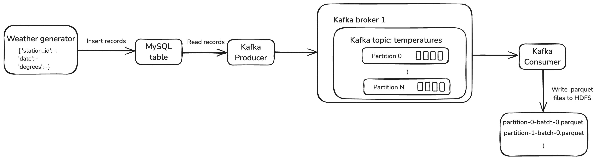

# P7 (4% of grade): Kafka, Weather Data

## Overview

In this project, you will simulate a scenario where daily weather data is received from multiple weather stations. These weather records are inserted into a MySQL database. Once stored, a Python program acting as a Kafka *producer* will read the records from the database and stream them into a Kafka topic. Then a second Python program, functioning as a Kafka *consumer*, will then subscribe to the topic, consume the incoming data, and write it into Parquet files. These files will be stored via Hadoop Distributed File System (HDFS) for scalability and long-term storage. Although you are not required to build it in this project, these Parquet files are intended to support future analytical tasks, such as generating a web-based dashboard.



For simplicity, we use a single Kafka broker instead of a cluster. A single producer will generate weather data in an infinite loop at an accelerated rate of 1 day per 0.1 seconds (you can change this during debugging). Finally, consumers will be different processes, launching from the same Python program.

Learning objectives:
* write code for setting up Kafka producers and consumers
* apply streaming techniques to achieve "exactly once" semantics
* use manual and automatic assignment of Kafka topics and partitions

Before starting, please review the [general project directions](../projects.md).

## Clarifications/Corrections

* April 15: requirements.txt moved to src/requirements.txt to avoid issues with autobadger
* April 17: added note about why you need to call `commit` even when your MySQL transactions only involve reading rows (not changing them)
* April 17: released `autobadger` for p7 (version **0.1.19**)
* April 21: updated  `autobadger` for p7 (version **0.1.20**)
* April 21: added a clarification about the directory to write the checkpoints.

## Containers setup

### Docker Compose

Take a look at the provided Docker compose file. There are several services, including a `kafka` container, `HDFS datanodes`, a `HDFS namenode`, a `SQL server`. The Kafka service is mounting the `src` directory. NameNode service will serve at the host of `boss` within the docker compose network.

### Docker image naming
Build the Docker images following this naming convention:
```
docker build . -f Dockerfile.hdfs     -t p7-hdfs
docker build . -f Dockerfile.kafka    -t p7-kafka
docker build . -f Dockerfile.namenode -t p7-nn
docker build . -f Dockerfile.datanode -t p7-dn
docker build . -f Dockerfile.mysql    -t p7-mysql
```
### PROJECT environment variable
The compose file assumes there is a "`PROJECT`" environment variable.  You can set it to p7 in your environment:

```
export PROJECT=p7
```
Start all services (including the Kafka broker) in the background using Docker:

```
docker compose up -d
```

In this project, you'll be creating three programs in the `src` directory mapped into the Kafka container:
1. `producer.py`
1. `debug.py`
1. `consumer.py` 
 
You can launch these in the same container as Kafka using: 

`docker exec -it -w /src p7-kafka python3 <name_of_program>`

This will run the program in the foreground, making it easier to debug. Note that the 3 programs you write will run forever, or until manually killed.

## Weather Generation (*weather_generator.py*)

Using the provided `weather_generator.py` file, you will infinitely generate daily weather data starting from 2000-01-01 for some imaginary stations and insert these weather records into a MySQL database.
Specifically inside a `temperatures` table within the `CS544` database.

### Running in Background

To run the weather generator in the background indefinitely use:

```
docker exec -d -w /src p7-kafka python3 weather_generator.py
```

To verify records are being stored in the DB, connect to the SQL container and directly query the table (review P4 if needed):

**Hint**: To connect to the DB (name: `CS544`, password: `abc`) in the terminal you can use: `mysql -u root -pabc CS544`

   ```mysql
    mysql> select * from temperatures limit 10;
    +----+------------+------------+--------------------+
    | id | station_id | date       | degrees            |
    +----+------------+------------+--------------------+
    |  1 | StationA   | 2000-01-01 | 23.851454295532143 |
    |  2 | StationB   | 2000-01-01 | 19.525202433007102 |
    |  3 | StationC   | 2000-01-01 | 22.977951196092594 |
    |  4 | StationD   | 2000-01-01 |  47.92533602679551 |
    |  5 | StationE   | 2000-01-01 |   52.0219652093013 |
    |  6 | StationF   | 2000-01-01 | 22.266228429236403 |
    |  7 | StationG   | 2000-01-01 |  30.72235799978964 |
    |  8 | StationH   | 2000-01-01 |  26.98481298988876 |
    |  9 | StationI   | 2000-01-01 |                  5 |
    | 10 | StationJ   | 2000-01-01 |                  0 |
    +----+------------+------------+--------------------+
    10 rows in set (0.00 sec)
   ```

## Part 1: Kafka Producer (*producer.py*)

### Topic Initialization

Create a `src/producer.py` that attempts to delete any prior topic
named `temperatures` (an `UnknownTopicOrPartitionError` exception will
be raised and can be caught/ignored if it doesn't exist), then creates
a new topic with the same name (`temperatures`) with 4 partitions and
1 replica.  If a previous topic is deleted, sleep for 3 seconds before
attempting to create the new one.

<!--
Feel free to use the following starter code:

```python
# producer.py
import time
from kafka import KafkaAdminClient
from kafka.admin import NewTopic
from kafka.errors import UnknownTopicOrPartitionError

broker       = 'localhost:9092'
topic_name   = 'temperatures'
admin_client = KafkaAdminClient(bootstrap_servers=broker)

try:
    admin_client.delete_topics([topic_name])
    print("Deleted topics successfully")
except UnknownTopicOrPartitionError:
    print("Cannot delete topic/s (may not exist yet)")

time.sleep(3) # Deletion sometimes takes a while to reflect

# TODO: Create topic 'temperatures' with 4 partitions and replication factor = 1

print("Topics:", admin_client.list_topics())

# TODO: Create a Kafka producer with the specified requirements
# TODO: Read records from MySQL table indefinitely and send them via Kafka producer
```
-->


### Read records from database

When we run the tester on your project, the prefix for your compose
containers will not be "p7", so use the `PROJECT` environment variable
to construct the correct `<PROJECT>-mysql-1` name for connecting to
the MySQL database.

Write code to read weather records from `temperatures` table
indefinitely, using sqlalchemy. You will send this data to Kafka
in the next step.  The `id` column is consecutive in the DB and always
increasing, so whenever you send a query to the DB asking for more
rows, only request rows with an `id` greater than the previously
greatest `id` seen.

**Important:** when we learned about DB transactions and gave examples with MySQL, we saw that changes to the DB aren't visible to other sessions until the transaction is explicitly committed with `<CONNECTION>.commit()`.  Transactions are relevant when you're just reading, too (as you are here).  If you read some rows, then read again as part of the same transaction, you won't see changes from other transactions that happened in between.  Thus, to get new rows each time you request them from the DB, be sure to call `commit` after each iteration.

### Sending weather reports via Kafka

Create a `KafkaProducer` with the following requirements:
1. Use a setting so that the producer retries up to 10 times when `send` requests fail.
2. Use a setting so that the producer's `send` calls are not acknowledged until all in-sync replicas have received the data.

Use the `KafkaProducer` to send the reports to the `temperatures` topic, with the following requirements:

1. For the Kafka message's `key` use Station ID.
2. For the Kafka message's `value`:
    - Encode the message as a gRPC protobuf.  
For this, you'll need to create a protobuf file `report.proto` in `src` 
with a `Report` message having the following fields, and build it to get 
a `???_pb2.py` file (review P2 for how to do this if necessary):
      * string **date** (format "YYYY-MM-DD"): Date of the observation
      * double **degrees**: Observed max-temperature on this date
      * string **station_id**: Station ID for the generated weather data
    - Use a `.SerializeToString()` call to convert a protobuf object to bytes (not a string, despite the name)

### Running in Background

When your producer is finished, consider running the producer in the background indefinitely:

```
docker exec -d -w /src p7-kafka python3 producer.py
```

## Part 2: Kafka Debug Consumer (*debug.py*)

Create a `src/debug.py` program that initializes a `KafkaConsumer`. This consumer should:

- be in a consumer `group_id` named "debug".
- subscribe to the `temperatures` topic; let the broker automatically assign the partitions.
- NOT seek to the beginning. The consumer should loop over messages forever, printing dictionaries corresponding to each message, like the following:

```
...
{'station_id': 'StationC', 'date': '2008-12-17', 'degrees': 35.2621, 'partition': 2}
{'station_id': 'StationC', 'date': '2008-12-20', 'degrees': 13.4537, 'partition': 2}
{'station_id': 'StationE', 'date': '2008-12-24', 'degrees': 35.3709, 'partition': 2}
{'station_id': 'StationA', 'date': '2008-07-06', 'degrees': 80.1362, 'partition': 3}
...
```

Use your `debug.py` to verify your Kafka producer is writing to the stream as expected using:
```
docker exec -it -w /src p7-kafka python3 debug.py
```

## Part 3: Kafka Consumer (*consumer.py*)

Now, you'll write a `src/consumer.py` script to read data from 1 partition only and to save it into Parquet format via HDFS storage.

This Kafka consumer should use manual partition assignment.  For example, if it is launched as:

`docker exec -it -w /src p7-kafka python3 consumer.py 0`

it should assign partition 0 to the `temperatures` topic.  Similarly, with arguments `2`, it will read from partition 2 only.

Feel free to start with the following code:

```python
# consumer.py
import os, sys
from kafka import KafkaConsumer, TopicPartition
from subprocess import check_output

os.environ["CLASSPATH"] = str(check_output([os.environ["HADOOP_HOME"]+"/bin/hdfs", "classpath", "--glob"]), "utf-8")

broker     = 'localhost:9092'
topic_name = 'temperatures'

def main():
    if len(sys.argv) != 2:
        print("Usage: python consumer.py <partition_number>")
        sys.exit(1)
    partition_id = int(sys.argv[1])

    # TODO: Create KafkaConsumer using manual partition assignment

if __name__ == '__main__':
    main()
```
### Write Parquet data to HDFS

Your consumer should write Parquet files after each batch inside a `data` directory in HDFS. Use the following nomenclature for the Parquet: `partition-N-batch-M.parquet`, where N is the partition number and M is the batch number starting with 0.

The Parquet files should have 3 columns corresponding to the columns of your protobuf messages (use the same names).

We have already pre-installed pyarrow and pandas for you; feel free to use them to arrange the message data in tabular format for writing to Parquet/HDFS.

**Hint**: To view the contents of a directory in HDFS you can use: `docker exec -it p7-kafka hdfs dfs -ls hdfs://boss:9000/data/`

```bash
hdfs://boss:9000/data/partition-0-batch-0.parquet
hdfs://boss:9000/data/partition-0-batch-1.parquet
hdfs://boss:9000/data/partition-0-batch-2.parquet
```

**Note:** at the rate we're generating data, each Parquet file will usually only have a couple rows, which is not a good use of Parquet/HDFS.  In practice, you would want to accumulate more data to write at once.  But for the sake of simplicity in this project, each Parquet file will correspond to a single Kafka batch.

## Part 4: Consumer Crash Recovery

### Write checkpoints to local disk

In addition to the Parquet data, your consumer should write the current batch number and the partition read offset to a JSON file named `partition-N.json` **located in the root directory of your Kafka container**. You can get this with a `consumer.position(????)` call.  Write the batch number as a top-level key in your JSON file, alongside offset data, like this:

```json
{

  "batch_id": 20,
  "offset": 255
}
```

### Restart

When your consumer starts, it should check whether the JSON file exist
with the offset corresponding to its assigned partition. If it exists, it should load that data, and seek to the previous offset, like this:

```python
consumer.seek(????)
```

If no previous JSON file was written, seek to offset 0 before reading any messages.

### Atomic Writes

Remember that we're producing the Parquet files so somebody else (not
you) can use them to build a web dashboard. What if the dashboard app
reads the Parquet file at the same time your consumer is updating the
file?  It's possible the dashboard or plotting app could read an
incomprehensible mix of old and new data.

To prevent such partial writes, the proper technique is to write
a new version of the data to a different file.  For example, say the
original file is `F.txt` -- you might write the new version to
`F.txt.tmp`.  After the new data has been completely written, you can
rename F.txt.tmp to F.txt.  This atomically replaces the file
contents. Anybody trying to read it will see all old data or all new
data.  Here is an example (`hdfs` is a `pyarrow.fs.HadoopFileSystem` object):

```python
# Atomic writes to HDFS
path = ????
path_tmp = path + ".tmp"
with hdfs.open_output_stream(path_tmp) as f:
    # TODO: write the data
    hdfs.move(path_tmp, path)
```

Be sure to write your Parquet files atomically.

### Reading Parquet Files

You are not required to write a program to read the Parquet files for this project, but it is helpful to think about how it should be done.  Imagine this happens:

1. consumer.py writes half a Parquet file, hdfs://boss:9000/data/partition-0-batch-100.parquet
2. consumer.py crashes before writing the checkpoint file
3. a reader wants to treat all the Parquet files as a big table and take the average degrees

If the reader reads the "100" file, it will fail, because that file is corrupt (partially written).  Instead, the reader should read the checkpoint file first, in which the last `batch_id` will be 99.  The reader should just read Parquet files 0-99 (inclusive) for partition 0, ignoring anything beyond that.

In class, we emphasived the importance of atomically writing data and consumer offsets together.  Although the checkpoint JSON files and Parquet files are separate, we still have the necessary atomicity because we write both a reference to the data (batch_id) and consumer offset to a single file atomically.


## Submission

All your code should be in a directory named
`src` within your repository.

We should be able to run the following on your submission to build and
run the required image:

```
# To build the images
docker build . -f Dockerfile.hdfs     -t p7-hdfs
docker build . -f Dockerfile.kafka    -t p7-kafka
docker build . -f Dockerfile.namenode -t p7-nn
docker build . -f Dockerfile.datanode -t p7-dn
docker build . -f Dockerfile.mysql    -t p7-mysql

# To start all services, including the kafka broker
export PROJECT=p7
docker compose up -d

# To build proto file
python3 -m grpc_tools.protoc -I=src/ --python_out=src/ report.proto

# To run the weather generator program
docker exec -d -w /src p7-kafka python3 weather_generator.py

# To run the producer program
docker exec -d -w /src p7-kafka python3 producer.py

# To run the debug program
docker exec -it -w /src p7-kafka python3 debug.py

# To run the consumer program (for partition 0)
docker exec -it -w /src p7-kafka python3 consumer.py 0

# To run the consumer program (for partition 2)
docker exec -it -w /src p7-kafka python3 consumer.py 2
```

Verify that your submission repo has a structure with at least the
following files committed:

```
<your p7 repository>
└── src
    ├── producer.py
    ├── debug.py
    ├── consumer.py
    ├── report.proto
```

## Testing

Please be sure that your installed autobadger is on version **0.1.20**. You can print the version using:

```bash
autobadger --info
```

Run p7 autobadger using:

```bash
autobadger --project=p7 --verbose
```

See [projects.md](https://git.doit.wisc.edu/cdis/cs/courses/cs544/s25/main/-/blob/main/projects.md#testing) for more information.
-->