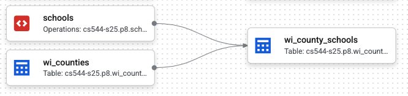

# P8 (4% of grade): Google Cloud Services

## Overview

In this project, you'll be using four Google cloud services to analyze
a dataset describing all the schools in Wisconsin.  You'll write your
code in Jupyter, which will run on a cloud VM, and you'll upload your
data to a GCS bucket.  You'll use Dataform to create a pipeline that
brings this data (in combination with public geographic data) into a
BigQuery dataset.  Finally, you'll use BigQuery to answer questions
about data.

Learning objectives:

- create a **VM** on a public cloud and connect to it via SSH
- create a **GCS bucket** and upload data to it
- write a **DataForm** pipeline to bring data from GCS to BigQuery storage
- write **BigQuery** queries to manipulate geographic data

Before starting, please review the [general project directions](../projects.md).

## Clarifications/Correction

- April 28: added  autobadger info for p8 (version 0.1.21)
- April 30: updated autobadger (version 0.1.22), minor fix, now accepts both single and double quotes (e.g., `${ref('wi_counties')}` and `${ref("wi_counties")}`) in wi_county_schools.sqlx

## Part 1: Virtual Machine Setup

### Educational Credits

We'll use Google's Cloud (GCP) for our virtual machines. They've
generously given each 544 student $50 in credits.  You can obtain the
credits here:
<https://canvas.wisc.edu/courses/450562/discussion_topics/2122215>

### Launch VM

You likely have some experience in creating VMs in a prior course (320
or 400), so these directions will be brief, and you can decide things
like what geographic region to create it in (I picked Iowa since it's
nearby), but here are some highlights:

- you can launch and see VMs from here: <https://console.cloud.google.com/compute/instances>
- Be sure to choose e2-medium for machine type.
- Update your boot disk settings to use the Ubuntu 24.04 LTS public image -- select the x86/64 version (**not Arm64**) — with a boot disk size of 25 GB. Once you select these settings, the monthly estimate should be about $25/month for the VM (if it’s not, you probably selected something wrong, and might run out of free credits before the end of the project).
- you may have modified firewall settings for other courses, but that's not necessary for 544
- you'll need to setup an SSH key so you can connect from your laptop: <https://console.cloud.google.com/compute/metadata?tab=sshkeys> (the browser-based SSH client won't work for what we need to do in this class)

There's a bit more explanation about SSH keys [here](ssh-keys.md).

(Optional) If you're worried about exhausting the free tier and your educational
credits, you might also want to setup a quota [here](https://console.cloud.google.com/iam-admin/quotas).

### GitLab

SSH authentication to GitLab is only enabled from machines on the same network (like your CSL VM).  That means you cannot use SSH keys to clone/pull/push your repo while working on your Google VM.  Instead, set a strong password here:

https://git.doit.wisc.edu/-/user_settings/password/edit

Then, when you clone your repo to your VM, use the HTTPS address instead of the SSH address.

Of course, if you're running into trouble, a short-term solution is to have your repo on a different machine (your laptop, or CSL VM) and `scp` files around as necessary.

### Jupyter Setup

Setup a Python `venv` for this project and install some packages:

```shell
sudo apt install python3-venv
python3 -m venv venv
source venv/bin/activate
pip3 install jupyterlab google-cloud-bigquery google-cloud-bigquery-storage bigquery-magics pyarrow tqdm ipywidgets pandas matplotlib db-dtypes pandas-gbq google-cloud-dataform google-cloud-storage
```

With your `venv` still active, run:

```bash
python3 -m jupyterlab --no-browser
```

1. Setup an SSH tunnel and connect (as done in previous projects)
2. You'll be prompted to copy/paste a token from the terminal to the browser.
3. Finally, create a notebook named `p8.ipynb` inside of `src/` in your project repo.

Create a `p8.ipynb` notebook inside of `src/`. You'll answer 10 questions in the notebook.

### Authentication

You'll also need to give your VM permission to access BigQuery. You can do so by pasting the following into the
terminal on your VM and following the directions. Please read the following cautions before running this command.

```
gcloud auth application-default login --scopes=openid,https://www.googleapis.com/auth/cloud-platform
```

#### Caution

1. While running the command, it will ask you to paste some link to your browser. If you have multiple Google accounts in your browser, and do not want this to select the default one, then do the following:
   - paste the link in an incognito mode
   - login to the Google account of your choice
2. **Be careful**, because if a malicious party were to gain access to your
   VM, they would have free access to all your cloud services. For example, if your Jupyter is listening publicly (i.e.,
   0.0.0.0 instead of localhost) and you have a weak password (or no
   password), someone could gain access to your VM, and then these other
   resources.
3. You may need to run this command again if you run into an error like `"Reauthentication is needed"`.

When you're not actively working, you may want to revoke (take away)
the permissions your VM has to minimize risk:

```bash
gcloud auth application-default revoke
```

### Questions

The following questions will help you check that you created your VM correctly.

#### Q1: What is the OS release?

Write some Python code in a cell starting with `#q1` that reads `/etc/os-release` to a string that is used for the cell output (last line of the cell -- don't use print).

#### Q2: What CPUs does your VM have?

Use the `subprocess` module that comes with Python to programmatically run the `lscpu` program and capture the output in a string that you'll use for the output.

<!--
### Google cloud CLI (if applicable)

**Only** run this if `gcloud` is not a valid command on your VM (Debian/Ubuntu):

```shell
curl https://packages.cloud.google.com/apt/doc/apt-key.gpg | sudo gpg --dearmor -o /usr/share/keyrings/cloud.google.gpg
echo "deb [signed-by=/usr/share/keyrings/cloud.google.gpg] https://packages.cloud.google.com/apt cloud-sdk main" | sudo tee -a /etc/apt/sources.list.d/google-cloud-sdk.list
sudo apt-get update && sudo apt-get install google-cloud-cli
```

## Notebook

## Outputs

> **Important:**
>
> If the output of a cell answers question
> 3, start the cell with a comment: `#q3`. The autograder depends on
> this to correlate parts of your output with specific questions.

> **Important**:
>
> The autograder will extract your output from these cells, so it won't
> give points if not formatted correctly (extra spaces, split cells,
> etc.).
>
> For this project, answers are simple types (e.g., `int`s,
> `float`s, `dict`s), so you'll need to do a little extra work to get
> results out of the DataFrames you get from BigQuery.

-->

## Part 2: GCS Bucket

Navigate to [Google Cloud Storage WebUI](https://console.cloud.google.com/storage/).  Manually create a private GCS bucket. Bucket names must be globally unique, so you'll need to think of a name that nobody else in the world has already used.  For location, choose `Multi-region`, `us (multiple regions in the United States`).

Use pyarrow (https://arrow.apache.org/docs/python/generated/pyarrow.fs.GcsFileSystem.html) in your Jupyter notebook to connect to your bucket.  Read the bytes from the local `wi-schools-raw.parquet` file and use pyarrow to write it to a new GCS file in your bucket.

#### Q3: What are the paths of all the files/directories in the top-level of your bucket?

Answer with a Python list.

#### Q4: What is the modification time of wi-schools-raw.parquet, in nanoseconds?

## Part 3: Dataform

You'll use Dataform to create a pipeline that brings data from your GCS bucket into a BigQuery dataset.  Create a private BigQuery dataset named `p8` within your project.  You can decide to do this manually via the cloud console or programatically using a BigQuery client in your notebook.  The dataset should have "US" as the data location.

### Dataform Setup

Now, let's create a Dataform workspace:

1. Navigate to [BigQuery](https://console.cloud.google.com/bigquery)
2. Click `Dataform` in the menu on the left
3. Click `Create Repository`
4. Choose any "Repository ID" you like, and select "us-central1" for the "Region".
5. Click "Grant all" so that Dataform can run BigQuery queries
6. Navigate to the newly created repo. Click `Create Development Workspace`. Give it an ID and navigate to it.
7. Click `Initialize Workspace`
8. Navigate to the Workspace and edit the "workflow_settings.yaml" file.  `defaultLocation` should be "US", and `defaultDataset` should be "p8".

Your Dataform code will be run by a default *service account*; you can think of a service account as basically being a non-human user with some permissions.  Your service account will need some additional permissions:

1. go to IAM (https://console.cloud.google.com/iam-admin/iam) to update permissions
2. click "Include Google-provided role grants
3. click the edit icon by the "Dataform Service Account"
4. it may already have some roles, but add roles as necessary to make sure it has these four: `BigQuery Admin`, `BigQuery Job User`, `Dataform Service Agent`, and `Storage Object Viewer`

### Pipeline Code

Now, create 3 `.sqlx` files on your VM defining Dataform actions:
`wi_counties.sqlx`, `schools.sqlx`, and `wi_county_schools.sqlx`.

Your notebook should contain code that uses a
`dataform.DataformClient` to call `.write_file(...)` to upload each of
these to the workspace that you created manually.  Your code should
also call `create_compilation_result` to compile your sqlx files.

* **wi_counties.sqlx**: select from `bigquery-public-data.geo_us_boundaries.counties` to materialize a table of counties within Wisconsin (you can hardcode FIPS code of 55 for Wisconsin).
* **schools.sqlx**: use a `LOAD DATA OVERWRITE...` query to create a table `<YOUR_PROJECT>.p8.schools` from the `wi-schools-raw.parquet` file in your GCS bucket.  The config should specify `type: "operations"` and `hasOutput: true` because the SQL doesn't return results, so Dataform cannot infer these details.
* **wi_county_schools.sqlx**: this should geographically join schools to counties to produce a table with (a) all the columns of schools, (b) a `location` column which is an `ST_GEOGPOINT` based on coordinates of the school, and (c) a `county_name` column indicating the county in which the school is located.  This should use Dataform references to the other tables (`wi_counties` and `schools`), like `${ref('INPUT_TABLE')}`.

If you did the above correctly, the "Compiled graph" (which you can view for Dataform in the cloud console) should look like this:



### Questions

The following questions will help you check that you created your pipeline correctly.

#### Q5: How many counties are in Wisconsin?

Query your new `wi_counties` table to calculate the answer.  Do your query in your notebook, using either Jupyter magic (`%%bigquery`) or pure Python (`bq.query(...)` where `bq` is a `bigquery.Client`).

#### Q6: How many public schools are there in Wisconsin?

Use your `wi_county_schools` table.  Find schools where `agency_type` is "Public school".

<!-- (Expecting 2116) -->

#### Q7: What are the dependencies between all the Dataform tables?

Answer with a dictionary of lists, where each key is an action, and the value is a list of dependencies for that action.  It should look like the following (possibly with additional entries if you have created other actions for practice):

```
{'schools': [],
 'wi_counties': [],
 'wi_county_schools': ['schools', 'wi_counties'],
 ...
}
```

**Hint:** your previous `create_compilation_result` should have
  returned a response object from which you can extract a compilation
  name: `.name`.  You can use this to lookup details about the
  pipeline in the compilation results:

```python
response = df_client.query_compilation_result_actions(
    request={"name": compilation_result_name}
)
```

You can loop over `response.compilation_result_actions`.  Each `action` will have an `action.target.name` and `action.relation.dependency_targets`.

## Part 4: BigQuery

#### Q8: How many schools are there in each county?

Manipulate your query results to produce a dictionary of counts, like this:

```
{'Milwaukee': 420, 'Dane': 217, 'Waukesha': 177, 'Brown': 123,
 'Outagamie': 96, 'Rock': 72, 'Marathon': 72, 'Racine': 68,
 'Winnebago': 65, 'Sheboygan': 63, 'La Crosse': 59, 'Kenosha': 56,
 'Washington': 56, 'Walworth': 56, 'Fond du Lac': 55, 'Eau Claire':
 54, 'Jefferson': 52, 'Dodge': 51, 'Wood': 47, 'Manitowoc': 44,
 'Sauk': 42, 'Columbia': 41, 'Barron': 40, 'Grant': 39, 'Portage': 38,
 'Ozaukee': 38, 'Clark': 38, 'Waupaca': 36, 'St. Croix': 35,
 'Chippewa': 35, 'Calumet': 30, 'Shawano': 29, 'Pierce': 29,
 'Marinette': 29, 'Vernon': 29, 'Polk': 28, 'Monroe': 28,
 'Trempealeau': 27, 'Juneau': 26, 'Green': 23, 'Dunn': 22, 'Oconto':
 20, 'Lafayette': 18, 'Door': 18, 'Douglas': 18, 'Crawford': 17,
 'Oneida': 17, 'Iowa': 16, 'Lincoln': 16, 'Washburn': 16, 'Green
 Lake': 15, 'Kewaunee': 15, 'Richland': 14, 'Langlade': 13, 'Taylor':
 13, 'Vilas': 13, 'Sawyer': 13, 'Waushara': 13, 'Ashland': 12,
 'Bayfield': 12, 'Buffalo': 11, 'Rusk': 11, 'Marquette': 10,
 'Jackson': 10, 'Price': 9, 'Burnett': 9, 'Pepin': 7, 'Forest': 7,
 'Menominee': 4, 'Adams': 3, 'Florence': 3, 'Iron': 3}
```

#### Q9: How many times can you do a query like Q8 before exhausting the BigQuery free tier?

Round down to produce an int.

#### Q10: For each public middle school in Dane County, what is the geographically closest public high school in Dane County?

Answer with a dictionary, like this:

```
{'Badger Ridge Middle': 'Verona Area High', 'Badger Rock Middle':
'West High', 'Belleville Middle': 'Belleville High', 'Black Hawk
Middle': 'Shabazz-City High', 'Central Heights Middle': 'Prairie
Phoenix Academy', 'Cherokee Heights Middle': 'Capital High', 'De
Forest Middle': 'De Forest High', 'Deerfield Middle': 'Deerfield
High', 'Ezekiel Gillespie Middle School': 'Vel Phillips Memorial High
School', 'Glacial Drumlin School': 'LaFollette High', 'Glacier Creek
Middle': 'Middleton High', 'Hamilton Middle': 'Capital High', 'Indian
Mound Middle': 'McFarland High', 'Innovative and Alternative Middle':
'Innovative High', 'James Wright Middle': 'West High', 'Kromrey
Middle': 'Middleton High', 'Marshall Middle': 'Marshall High', 'Mount
Horeb Middle': 'Mount Horeb High', 'Nikolay Middle': 'Koshkonong
Trails School', "O'Keeffe Middle": 'Innovative High', 'Oregon Middle':
'Oregon High', 'Patrick Marsh Middle': 'Prairie Phoenix Academy',
'Prairie View Middle': 'Sun Prairie West High', 'River Bluff Middle':
'Stoughton High', 'Savanna Oaks Middle': 'Capital High', 'Sennett
Middle': 'LaFollette High', 'Sherman Middle': 'Shabazz-City High',
'Spring Harbor Middle': 'Capital High', 'Toki Middle': 'Vel Phillips
Memorial High School', 'Waunakee Middle': 'Waunakee High', 'Whitehorse
Middle': 'Monona Grove High', 'Wisconsin Heights Middle': 'Wisconsin
Heights High'}
```

Given you need to give the High School with the minimum distance, you
may want to use the `MIN_BY` aggregate
(https://cloud.google.com/bigquery/docs/reference/standard-sql/aggregate_functions#min_by)
instead of `MIN`.

You are not required to report the actual distances to the nearest
schools, but it may help to know for debugging (the below distances are in kilometers):

```
{'Badger Ridge Middle': 1.8392052150991804, 'Badger Rock Middle':
5.29072039608733, 'Belleville Middle': 0.0, 'Black Hawk Middle':
3.2208653727303473, 'Central Heights Middle': 0.0, 'Cherokee Heights
Middle': 3.0891335611917463, 'De Forest Middle': 0.7104369448866054,
'Deerfield Middle': 0.0, 'Ezekiel Gillespie Middle School':
0.20996167824816614, 'Glacial Drumlin School': 8.422858770109299,
'Glacier Creek Middle': 10.380886949942708, 'Hamilton Middle':
1.6888876951751441, 'Indian Mound Middle': 0.3181930065207676,
'Innovative and Alternative Middle': 0.0, 'James Wright Middle':
3.099031509318725, 'Kromrey Middle': 0.633645628693037, 'Marshall
Middle': 0.3692934702053087, 'Mount Horeb Middle': 0.2247088214705937,
'Nikolay Middle': 2.7825509153862193, "O'Keeffe Middle":
1.1801078611747235, 'Oregon Middle': 2.199089113737385, 'Patrick Marsh
Middle': 2.995356862757154, 'Prairie View Middle': 1.4469952774362715,
'River Bluff Middle': 1.491373618930982, 'Savanna Oaks Middle':
7.439620069162148, 'Sennett Middle': 0.1614363991779063, 'Sherman
Middle': 0.0, 'Spring Harbor Middle': 3.0043175181011414, 'Toki
Middle': 3.9513342414992176, 'Waunakee Middle': 0.23741587309479018,
'Whitehorse Middle': 2.252781418278708, 'Wisconsin Heights Middle':
0.0}
```

## Submission

When you are all done, commit and push to GitLab.

Verify that your submission repository has the following structure with at least these files committed:

```
<your p8 repository>
└── src
    ├── definitions
    │   ├── wi_counties.sqlx
    │   ├── schools.sqlx
    │   └── wi_county_schools.sqlx
    └── p8.ipynb
```

Do not forget to revoke the permission to access your cloud account:

```
gcloud auth application-default revoke
```

## Testing

Please be sure that your installed autobadger is on version **0.1.21**. You can print the version using:

```bash
autobadger --info
```

Run p8 autobadger using:

```bash
autobadger --project=p8 --verbose
```

See [projects.md](https://git.doit.wisc.edu/cdis/cs/courses/cs544/s25/main/-/blob/main/projects.md#testing) for more information.